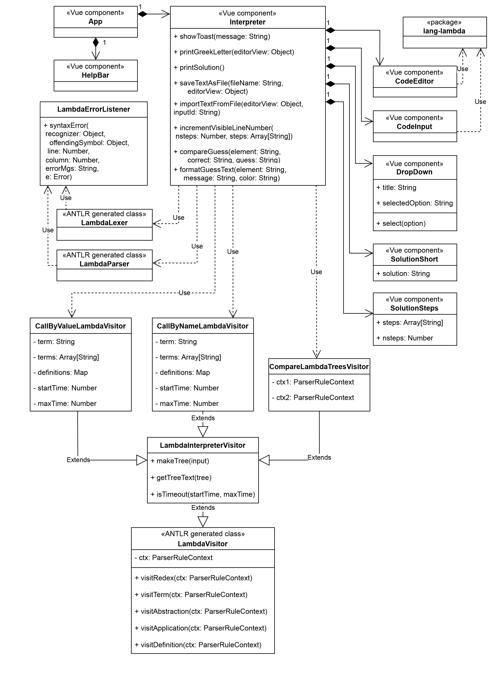

# Interactive Web-based Interpreter of the λ-Calculus
This tool evaluates terms in a simple theoretical programmming language lambda calculus.

The tool is meant to be used as a teaching aid which provides students with an environment for visualising reduction steps of lambda calculus terms and also determine whether user's guess is semantically correct.

> The application is available at [https://andrea-fer.github.io/lambda-interpreter/](https://andrea-fer.github.io/lambda-interpreter/)

## Setup instructions
For local setup of the application, you need to have installed the package manager tool npm which is included in nodejs installation:
- [nodeJS](https://nodejs.org/en/download) - LTS (Long Term Support) version

The packages needed for the application (versions are specified in configuration file `package.json`) need to be installed using the following command:
````bash
npm install
````

### Running the application locally
After installing needed packages the application can be run locally following these steps:
1. Navigate to the project directory
2. Run Vite server typing `npm run dev` into the command line
3. Local server will be hosted at `http://localhost:5173/`

### Updating program files after changes
#### Updating files for syntax highlighting:
The local package for syntax highlighting `lang-lambda` is to be updated using the following command:  
````bash
npm run prepare
````
#### Updating interpreter's grammar files
After any changes in the file `Lambda.g4`, a new Javascript files for Lexer and Parser must be generated using command:
````bash
antlr4 -Dlanguage=JavaScript lambda.g4 -visitor
````

### Build instructions
The application can be built for deployment running the following command:
```bash
npm run build
````
The program build will be located inside `dist` folder.

## Project class diagram
